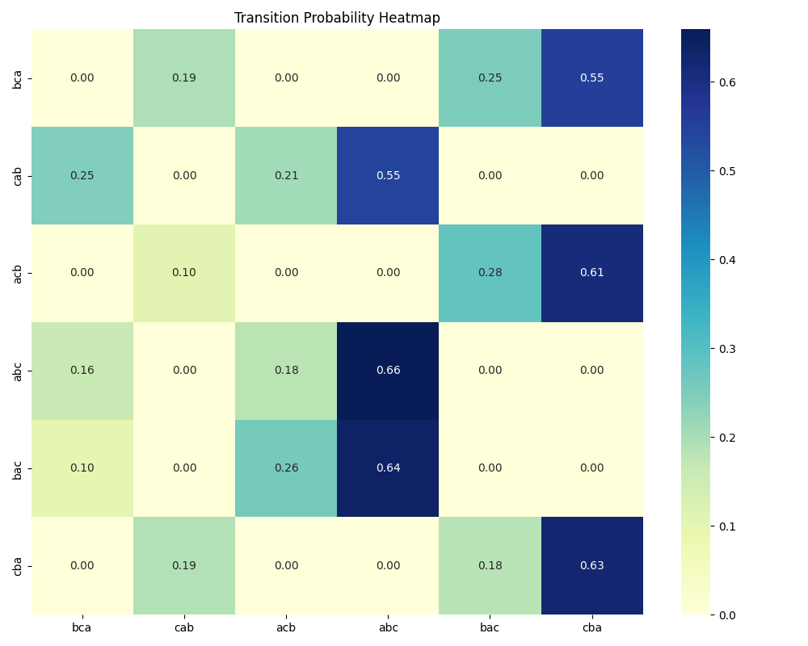
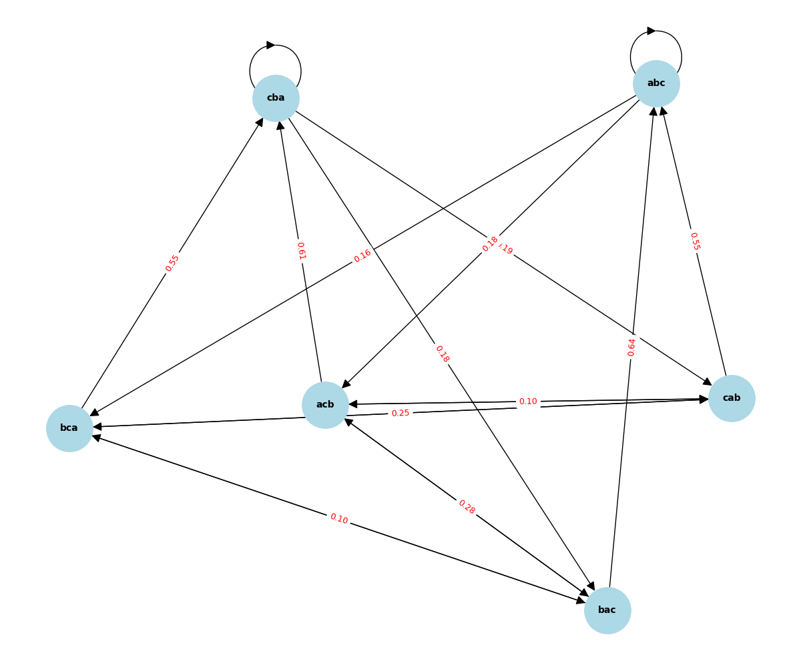

# Zaman Serilerinde Anomali Tespiti: LSTM, GRU ve Olasılıksal Otomata Karşılaştırması

Bu proje, "From Black-Box to Explainability: Probabilistic Automata for Time Series Analysis" kapsamında zaman serisi anomali tespiti için geliştirilmiştir. Aşağıdaki tablolar, modellerin performans, genellenebilirlik, gürültüye dayanıklılık ve çalışma süreleri analizlerini içermektedir.

## 1. Temel Performans ve Stabilite
Aşağıdaki tablo, modellerin iki farklı veri seti (BATADAL ve SKAB) üzerindeki ortalama F1-skorlarını ve 5 farklı random seed (42, 123, 2026, 7, 999) ile elde edilen standart sapma değerlerini göstermektedir. Verilerdeki aşırı dengesizlik (imbalance) nedeniyle modellerin tüm seed'lerde benzer davranış (0.0 F1) sergilediği görülmüştür.

**Tablo 1: Model Performansı ve Stabilitesi (Ortalama F1-score ± Standart Sapma)**
| Model | SKAB | BATADAL |
| :--- | :--- | :--- |
| **LSTM** | 0.0000 ± 0.0000 | 0.0000 ± 0.0000 |
| **GRU** | 0.0000 ± 0.0000 | 0.0000 ± 0.0000 |
| **1D-CNN** | Uygulanmadı | Uygulanmadı |
| **Automata**| 0.0000 ± 0.0000 | 0.0000 ± 0.0000 |

## 2. Gürültü ve Unseen Veri Analizi (Robustness)
Modellerin veri kalitesindeki düşüşlere (Gaussian Noise) ve daha önce karşılaşılmamış örüntülere (unseen patterns) karşı direnci test edilmiştir. Otomata modelinin görülmemiş (unseen) verilerde Levenshtein algoritması ile en yakın pattern'a (Mesafe: 1) başarıyla eşleme yaptığı birim testlerle kanıtlanmıştır.

**Tablo 2: Gürültü Etkisi ve Unseen Senaryo Analizi**
| Model | Orijinal (F1) | Gürültülü (F1) | Unseen Analizi (Det. Rate / Map. / Acc.) |
| :--- | :--- | :--- | :--- |
| **LSTM** | 0.0000 | 0.0000 | Uygulanamaz (Kara Kutu) |
| **GRU** | 0.0000 | 0.0000 | Uygulanamaz (Kara Kutu) |
| **1D-CNN** | - | - | - |
| **Automata**| 0.0000 | 0.0000 | Unseen Tespit Edildi / Eşleşme: 'abc' / Mesafe: 1 |

## 3. Çapraz Veri Seti (Cross-Dataset) Genellenebilirliği
Modeller BATADAL veri setinde eğitilmiş ve yapısal olarak tamamen farklı olan SKAB veri setinde test edilmiştir.

**Tablo 3: Cross-Dataset Performans Karşılaştırması**
| Train/Test | SKAB (F1-Score) | BATADAL (F1-Score) |
| :--- | :--- | :--- |
| **Train: BATADAL** | 0.0000 (Cross) | 0.0000 (Orijinal) |
| **Train: SKAB** | 0.0000 (Orijinal) | 0.0000 (Cross) |

## 4. Automata Parametre ve Süre Analizi
Otomata modelinin iç parametrelerinin (Window Size ve Alphabet Size) modelin öğrendiği durum (state) sayısına etkisi ölçülmüştür. (Bu analizin çizgi grafiği `models/parametre_duyarlilik_grafiki.png` konumundadır).

**Tablo 4: Automata Parametre Duyarlılık Analizi (Öğrenilen State Sayısı)**
| Window Size | A=3 | A=4 | A=5 | A=6 |
| :--- | :--- | :--- | :--- | :--- |
| **W=3** | 6 | 6 | 6 | 6 |
| **W=4** | 12 | 24 | 24 | 24 |
| **W=5** | 30 | 60 | 117 | 117 |
| **W=6** | 85 | 156 | 271 | 397 |

Ayrıca, tüm modellerin eğitim (Training) ve çıkarım (Inference) süreleri performans açısından kıyaslanmıştır. Otomata modeli, derin öğrenme modellerine göre inanılmaz bir hız avantajı sunmaktadır.

**Tablo 5: Modellerin Çalışma Süresi (Runtime) Karşılaştırması**
| Model | Training Time (sn) | Inference Time (sn) |
| :--- | :--- | :--- |
| **LSTM** | 2.05 | 0.16 |
| **GRU** | 2.19 | 0.18 |
| **1D-CNN** | - | - |
| **Automata**| 0.12 | 0.00 |

## 5. Olasılıksal Açıklanabilirlik Modülü (Zorunlu Çıktı)
Test verisindeki bir an için (time_step: 5) sistemin matematiksel gerekçesi ve yol olasılığı hesabı:

```json
{
    "time_step": 5,
    "state": "abcc",
    "pattern": "abcc",
    "status": "seen",
    "mapped_to": "abcc",
    "probability": 0.6435,
    "decision": "normal"
}
```

## 6. Automata Model Görselleri
Aşağıda, Otomata modelinin nasıl çalıştığını şeffaf bir şekilde gösteren durum geçiş diyagramı ve geçiş olasılıkları ısı haritası yer almaktadır.


